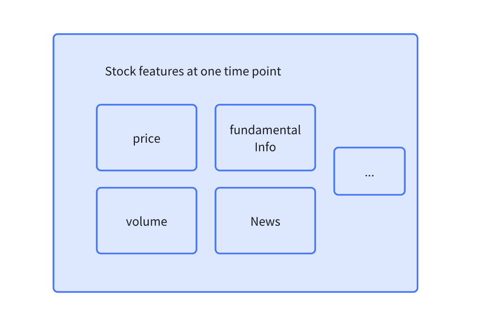
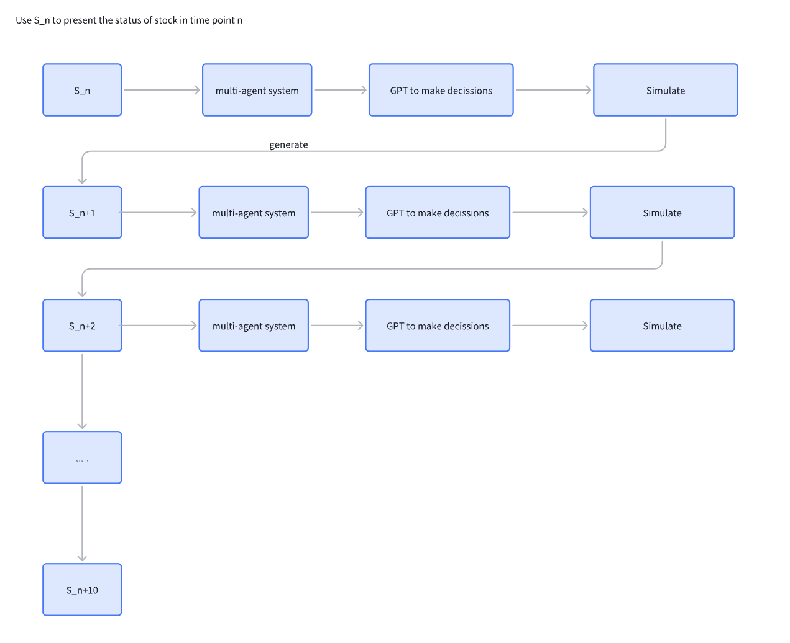
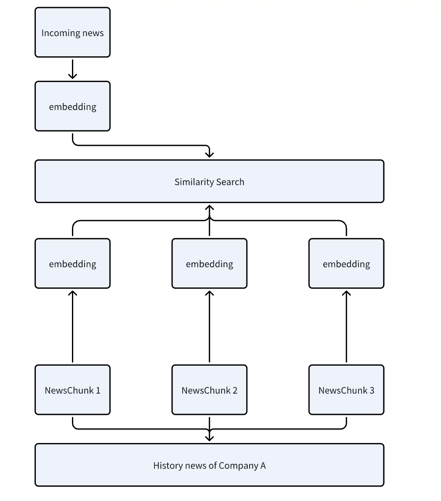
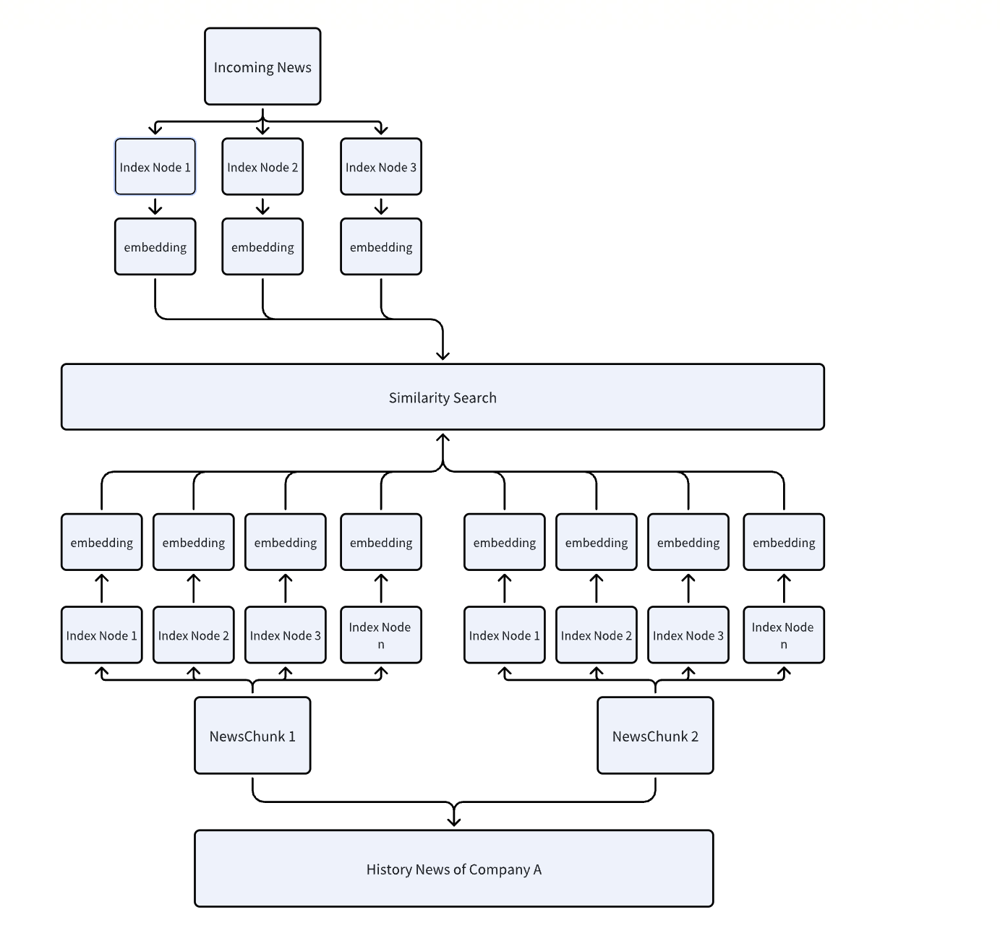

# Quant-Agents (初始化开发中,欢迎感兴趣的联系我加入)
基于LLM-多智能体的量化股票分析、股价预测系统

## 如何使用LLM+多智能体进行股价预测
因为LLM如ChatGPT无法直接对于股票价格给出预测，也许出于道德考虑，或者是无法获取最新数据等原因。所以我们需要通过间接的方式进行股价预测。我们给出的方法是：
1. 通过LLM构建多个agent，结合新闻、股票技术指标等同步进行买卖行为的预测。（LLM可以很好的做到指令遵循和文本分析）  
2. 通过买卖行为生成对应买卖报价单
3. 通过虚拟市场结合买卖单，计算出下一轮价格作为预测价格


### 流程图



### 多智能体系统设计


### Prompt 设计
```python
prompt = """
**Background**: Chinese Stock trade Market, you should play the Role below and give your action(buy/sell) and your possibility(0 to 100)
**Aim**: Maximum your profit no matter long or short term, depends on your Investment style
**Role Description**: 
        You are a senior stock trader using the funds raised for investment.
        You hope to achieve a better performance than other similar funds in the same time period, and need to consider whether to use game or cooperation tactics to achieve this.
        Your fund has a large amount of capital, so you need to consider the impact of buying and selling on market performance.
        
Role Info: 
Role:Senior Trader
Investment style: Value Investing 
Risk tolerance (0-10): 7
Greediness (0-10): 7
Investment aggressiveness (0-10): 7

**Stock Fundamental Info**:Fundamental Information of 中大力德:
{
  "报告期:2023中期": [
    {
      "分类": "通用设备制造业",
      "营业收入(万)": 54000.0,
      "占主营收入比": 100.0,
      "毛利率": 21.17
    },
    {
      "分类": "合计",
      "营业收入(万)": 54000.0,
      "占主营收入比": 100.0,
      "毛利率": 21.17
    }
  ]
}


**Technical indicators Info**:Price Info List sampled by 1 day:
Price List: [36.35, 36.09, 37.34, 36.1, 35.25, 33.81, 34.45, 33.14, 36.45, 36.3, 37.73, 38.09, 37.66, 37.66, 39.14]
Volume List: [201983.0, 124129.0, 199744.0, 144931.0, 90611.0, 94242.0, 80471.0, 74000.0, 116032.0, 171154.0, 243096.0, 196883.0, 165088.0, 118952.0, 186347.0]
The mean price is sampled by frequency 1 day
The long term period is 30 days, the short term period is 10
The cross information is No cross
The Bollinger info:
bollinger status:normal, no reacing neither up nor down
bollinger trend: Bollinger Middle Band Trend Up
MACD Info:
The macd line is no crossover and the histogram is 0.28

**Related News**:[{"date": "2023-06-16 16:18:34", "title": "近日海外机构调研股名单", "content": "股价上涨的有中大力德、华利集团等，表现最好的是中大力德，累计涨幅为34.65%。股价下跌的有26只，跌幅最大的是康辰药业，累计跌幅为18.47%。（数据宝） 近10日海外机构调研股证券代码证券简称海外机构家数最新收盘价（元）期间涨跌幅（%）行业002896中大力德635.8334"}, {"date": "2023-06-14 17:09:26", "title": "速看 最新筹码集中股找到了（附股）", "content": "8.22机械设备001288运机集团10690-17.31-4.93机械设备301308江波龙25297-13.49-7.04电子002896中大力德30321-12.666.51机械设备301068大地海洋3080-12.454.48环保301286侨源股份4673-10.532"}, {"date": "2023-06-12 09:45:43", "title": "190家公司获机构调研（附名单）", "content": "机构调研股一览证券代码证券简称机构调研次数机构家数最新收盘价（元）期间涨跌幅（%）行业688268华特气体122981.03-4.61电子688283坤恒顺维112757.99-0.48通信002896中大力德18625.69-3.46机械设备688766普冉股份185168.00-3.77电子000513丽珠集团18238.752.03医药生物002867周大生18016"}, {"date": "2023-06-09 09:16:51", "title": "185家公司获机构调研（附名单）", "content": "60医药生物688283坤恒顺维112757.03-2.20通信688062迈威生物19420.58-10.33医药生物002867周大生29116.27-0.79纺织服饰002896中大力德18626.42-3.01机械设备688766普冉股份185161.59-10.24电子600633浙数文化17313.362.12传媒603209兴通股份16930"}, {"date": "2023-06-08 09:09:41", "title": "194家公司获机构调研（附名单）", "content": "16-4.86通信688139海尔生物110454.07-8.50医药生物688062迈威生物19421.78-3.71医药生物002896中大力德18626.40-5.04机械设备600633浙数文化17313.624.53传媒603918金桥信息16834.0822.59计算机300853申昊科技16132"}, {"date": "2023-06-08 17:03:18", "title": "股东户数降幅榜：5股最新股东户数降逾一成", "content": "748.43通信000790华神科技43184-8.41-2.29医药生物688500*ST慧辰4539-7.3312.19计算机002896中大力德34718-7.333.61机械设备300530领湃科技6067-7.30-8.08基础化工002871伟隆股份9575-7.01"}, {"date": "2023-06-05 09:03:54", "title": "301家公司获机构调研（附名单）", "content": "47机械设备688147微导纳米111451.104.18电力设备688139海尔生物110458.79-4.38医药生物300394天孚通信110172.825.89通信002896中大力德110126.61-3.45机械设备002559亚威股份1958.58-2.39机械设备600378昊华科技19337.55-1.65基础化工301052果麦文化19260"}, {"date": "2023-05-22 21:24:11", "title": "连续三天20CM涨停 机器人概念股丰立智能成色几何？", "content": "94%、远方信息（300306.SZ）、汉王科技（002362.SZ）、晋拓股份（603211.SH）、中大力德（002896.SZ）、柯力传感（603662.SH）、睿能科技（603933.SH）6只个股涨停，其中中大力德3天内第二次涨停，柯力传感和睿能科技均为两连板。 此外，美亚柏科（300188"}, {"date": "2023-05-21 17:20:22", "title": "国产RV减速器加速突破 相关企业扩产意愿强烈|行业观察", "content": "国内减速器企业不断定点突破，RV减速器国产化率处于加速提升阶段，相关企业纷纷入局。财联社记者从业内获悉，目前RV减速器下游需求比较旺盛，中大力德（002896.SZ）、秦川机床（000837.SZ）、巨轮智能（002031.SZ）在手订单饱和，相关公司扩产意愿强烈。 国产加速，企业扩产意愿强烈"}, {"date": "2023-05-18 17:38:05", "title": "股东户数降幅榜：11股最新股东户数降逾一成", "content": "28机械设备002363隆基机械39185-0.683.77汽车300481濮阳惠成25682-0.68-2.29电子300782卓胜微66314-0.66-6.53电子002896中大力德27978-0.6614.93机械设备300830金现代26425-0.6512.77计算机000728国元证券116627-0.650"}, {"date": "2023-05-16 17:03:40", "title": "筹码新动向：213股筹码趋向集中", "content": "85公用事业002363隆基机械39185-0.680.87汽车300481濮阳惠成25682-0.68-2.62电子300782卓胜微66314-0.66-3.47电子002896中大力德27978-0.661.15机械设备300830金现代26425-0.658.19计算机000728国元证券116627-0.650"}, {"date": "2023-04-28 16:52:01", "title": "海外机构调研股名单 伟星新材最受关注", "content": "22计算机002410广联达2658.00-13.48计算机300358楚天科技815.72-13.53医药生物002009天奇股份112.14-13.72机械设备002896中大力德121.70-13.72机械设备002727一心堂628.89-13.84医药生物002859洁美科技125.10-13.89电子300762上海瀚讯212"}, {"date": "2023-03-10 16:12:55", "title": "海外机构调研股名单 奥普特最受关注", "content": "43机械设备600515海南机场34.16-3.48综合000876新希望712.81-3.54农林牧渔688392骄成超声26128.00-3.59电力设备002896中大力德125.17-3.64机械设备002008大族激光128.21-3.65机械设备601528瑞丰银行17.51-3.72银行688690纳微科技453"}, {"date": "2023-03-15 21:13:39", "title": "3月16日上市公司重要公告集锦：国联证券控股股东竞得民生证券30.3%股份 成交价91.05亿元", "content": "江苏证监局拟决定：对徐元生给予警告，并处以六十万元罚款。 中大力德：拟设立新加坡全资子公司及泰国全资孙公司 中大力德002896)公告，为满足东南亚市场对减速电机、减速器等产品的日益增长需求和技术服务要求，公司拟在新加坡设立全资子公司新加坡中大力德智能传动公司，投资总额不超过3680万美元"}, {"date": "2023-03-10 17:13:12", "title": "筹码新动向：225股筹码趋向集中", "content": "022.79电力设备300289利德曼23422-1.01-2.44医药生物688001华兴源创9603-0.97-6.65机械设备002896中大力德32255-0.95-4.88机械设备603421鼎信通讯18290-0.940.29通信603090宏盛股份6681-0.93-9"}, {"date": "2023-03-02 17:10:02", "title": "9股最新股东户数降逾一成", "content": "022.21电力设备300289利德曼23422-1.01-0.16医药生物688001华兴源创9603-0.97-5.06机械设备002896中大力德32255-0.950.53机械设备603421鼎信通讯18290-0.943.34通信603090宏盛股份6681-0.930.00机械设备301333诺思格4358"}, {"date": "2023-03-08 14:09:30", "title": "速看 最新筹码集中股找到了（附股）", "content": "0.59电力设备300289利德曼23422-1.01-2.60医药生物688001华兴源创9603-0.97-6.44机械设备002896中大力德32255-0.95-5.93机械设备603421鼎信通讯18290-0.94-1.18通信603090宏盛股份6681-0.93"}, {"date": "2023-08-31 09:47:59", "title": "掘金龙虎榜 39股近期获机构净买入", "content": "747.95 301421 波长光电 37.69 4437.66 1177.90 3259.76 0.56 13456.74 002896 中大力德 6.08 5177.04 2093.14 3083.90 1.30 17440.32 600753 庚星股份 15.69 2951"}, {"date": "2023-08-30 15:32:28", "title": "涨停股复盘：7股封单超亿元", "content": "33计算机000670盈方微6.418.361275.558176.26电子002855捷荣技术11.001.00718.067898.65电子002896中大力德36.999.74167.046178.80机械设备002222福晶科技27.1710.25223.716078.20电子600877电科芯片13"}, {"date": "2023-08-30 11:56:35", "title": "34只股上午收盘涨停附股)", "content": "63电力设备688191智洋创新21.843.64666.7614562.07电力设备688651盛邦安全65.5326.55216.8114207.46计算机002896中大力德36.999.37338.6112525.19机械设备688135利扬芯片22.936.91510.1411697.51电子002855捷荣技术11"}]

You should only respond in JSON format as described below 
Response Format: 
{'Risk tolerance': 0, 'Investment style': 'style', 'Investment aggressiveness': 2, 'decisions': [{'action': 'buy or sell', 'probability': 20, 'percent': 'how much percent you wanna sell/buy. float type,0-100'}]} 
Ensure the response can be parsed by Python json.loads. Don't explain reasons


"""
```
## 🎯 Key Features

## Key Points
- 如何使用LLM进行复杂的股价预测

## 如何判断新闻是否可能和标的相关？

### 传统通过向量相似度判断


### Multi-index 方法
我们常识引入了一种新的Multi-index的方法来从市场中的所有新闻中，找出和标的相关的新闻。通过对于与标的强相关的历史新闻进行实体抽取，获取到新的**index node**作为相似度匹配的索引。当新的新闻出现时，通过判断是否与相关索引相似来判断新的新闻是否应该加入到prompt引擎中。  
例如对于测试标的**捷荣技术**：  
历史新闻：
- “华为概念股”捷荣技术盘中再次涨停，录得21天16板。 9月26日晚，东莞捷荣技术股份有限公司（捷荣技术，002855）就股票交易异常波动及严重异常波动发布公告，再次强调近期公司经营情况及内外部经营环境未发生重大变化，今年上半年华为业务占比只有3.7%，占公司整体营业收入较小

进行提取后的实体作为索引节点：
- 华为
- 东莞捷荣技术股份有限公司

历史新闻：
- 2024、2025年中国、欧洲市场将相继迎来快速增长。需求快速增长背景下，海外供应或迎瓶颈，有望加快国内风电产业链出口。 捷荣技术走出21天16板 年内涨幅506.98% 华为概念股捷荣技术今日再度发力涨停，走出21天16板的上涨行情，年内累计大涨506.98%，今日盘中一度超过鸿博股份，成为年内涨幅最大的个股

进行提取后的实体作为索引节点：
- 中国
- 欧洲
- 风电产业链
- 华为
- 德恩精工


