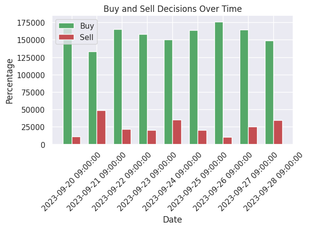
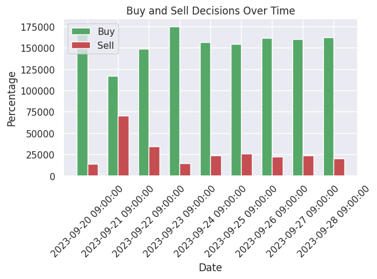

# Experiment Result Record and Analysis of the Performance of LLM make Finance decissions

[Notebook address](./../notebooks/estimate_llm_decission_performance.ipynb)

## Data chosen for test

1. Choose several stocks.

## Experiment Design

## Results and Conclusions

1. **Under same pre-conditions(agents info, news, stock) the LLM can make almost same decissions.** Below two figs shows the results of "Buy/Sell attitude" under same pre-conditions tested twice. From which, we can see the LLM's outputs are almost same and shows the similar buy and sell attitude.

[Notebook address](./../notebooks/estimate_llm_decission_performance.ipynb)

2. With the change of pre-conditions of agents such as investmen style, greedness, role, risk tollerance, the buy/sell attitude will change, which is the key element leads to success.